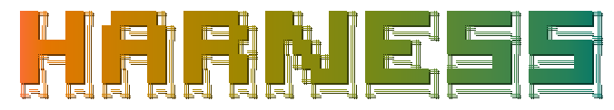

<div align="center">
  <picture>
    <source media="(prefers-color-scheme: dark)" srcset=".github/logo-dark.svg">
    <source media="(prefers-color-scheme: light)" srcset=".github/logo-light.svg">
    
  </picture>

  <p>AI-powered software delivery orchestration</p>
</div>

<div align="center">
  <a href="#quick-start">Quick Start</a> &middot;
  <a href="https://github.com/cosmo-wise/harness-public/issues/new?labels=bug">Report Bug</a> &middot;
  <a href="https://github.com/cosmo-wise/harness-public/issues/new?labels=feature">Feature Request</a> &middot;
  <a href="docs/ROADMAP.md">Roadmap</a>
</div>

---

## Why Harness?

AI coding tools are good at generating code, but a single file is not a delivery. Real software delivery requires planning across multiple files, iterative quality checks, parallel execution across agents, browser-based visual verification, and an auditable trail of what happened and why.

Harness orchestrates the gap between code generation and software delivery — planning what to build, generating it through multiple specialized agents, evaluating the results against defined criteria, iterating on weaknesses, and capturing evidence at every step.

## Features

- **Multi-agent orchestration** — Defines Planner, Generator, and Evaluator agents that work together on a single task. Each agent runs in its own context with configurable timeouts and model backends.
- **Iterative refinement with scoring** — Runs a coding loop across multiple iterations, scoring each attempt against weighted criteria (functionality, code quality, architecture, originality). Continues until a score threshold is met or improvement plateaus.
- **Render audit** — Launches a browser against generated frontend projects and verifies visual output, not just test results. Catches layout breakage, console errors, and rendering defects.
- **Parallel sprint execution** — Splits large tasks into parallel sprints when the work is independent, with auto-detection of concurrency opportunities.
- **Trace evidence capture** — Records every phase (plan, generate, evaluate, audit) as structured evidence. Produces an auditable trail consumable by downstream governance and display tools.
- **Config-driven task definition** — every run is defined by a YAML config file: task description, agent setup, scoring criteria, iteration parameters, and audit mode. No code changes needed to reconfigure a run.
- **Multi-model support** — Works with Claude (Anthropic), GPT (OpenAI), and custom model endpoints. Air-gapped/offline deployment available for enterprise.
- **Human-in-the-loop approval** — Runs can pause for human review, approval, or rejection at decision points.

## Quick Start

The fastest way to see Harness in action is with one of the public example tasks.

### Run a basic LRU Cache task

```bash
harness run -c examples/tasks/01-lru-cache/harness.yaml \
  --working-dir ./output/01-lru-cache
```

This runs a multi-agent loop that plans, implements, and evaluates a TypeScript LRU Cache class, iterating up to 4 times until scoring criteria are met.

### Run a frontend render audit

```bash
harness run -c examples/tasks/10-frontend-render-audit/harness.yaml \
  --working-dir ./output/10-frontend-render-audit
```

Harness generates a Vite + React landing page, then launches a browser to audit the rendered result for layout, console errors, and visual polish.

## Usage

### Define a task

A Harness task is a YAML configuration file:

```yaml
task: |
  Implement a TypeScript LRU Cache class.
  Include full vitest test suite.

agents:
  planner:
    cli: claude
    timeout: 300000
  generator:
    cli: claude
    timeout: 600000
  evaluator:
    cli: claude
    timeout: 300000

iterations:
  max: 4
  scoreThreshold: 85
  minImprovement: 3

criteria:
  - name: functionality
    weight: 40
  - name: code_quality
    weight: 30
  - name: architecture
    weight: 20
  - name: originality
    weight: 10
```

### How scoring works

Each run produces a score (0-100) based on the weighted criteria. The loop continues until:

- The score reaches `scoreThreshold`, or
- The improvement between iterations drops below `minImprovement`, or
- The iteration count reaches `max`

### Available examples

| Task | Type | Description |
|------|------|-------------|
| `examples/tasks/01-lru-cache/harness.yaml` | Coding loop | Minimal reproducible agent coding loop |
| `examples/tasks/10-frontend-render-audit/harness.yaml` | Render audit | Frontend generation with browser verification |

## When to use Harness

- **You run multi-step AI coding tasks** that need planning, iteration, and verification
- **You need quality gates** on generated code — automated scoring against defined criteria
- **You build frontend projects with AI** and want browser-based visual auditing
- **You need an auditable trail** of what each agent did and how the result was evaluated
- **You want to parallelize** independent sprints across multiple agent instances

Harness is not a code completion tool or a single-file generator. It is an orchestration layer for structured, repeatable delivery workflows.

## Install

```bash
npm install -g @cosmo-wise/harness
```

Then run tasks with:

```bash
harness run -c <config.yaml> --working-dir <output-dir>
```

See [SUPPORT.md](SUPPORT.md) for community, commercial, and enterprise support options. Air-gapped deployment is available for enterprise customers.

---

## How It Works

A Harness run moves through four phases in sequence:

1. **Plan** — the Planner agent reads the task and produces a build plan with file structure, dependencies, and sprint decomposition
2. **Generate** — the Generator agent executes the plan, producing code across one or more files
3. **Evaluate** — the Evaluator agent scores the output against weighted criteria and identifies weaknesses
4. **Audit** — when configured, a browser-based render audit checks frontend output visually

If the score is below threshold, Harness loops back to generation with the evaluator's feedback. Each phase records structured evidence via the [Trace](docs/integrations/trace.md) protocol.

→ [Architecture and contracts](docs/contracts/README.md)

## Configuration

Harness runs are configured entirely through YAML. Key sections include agent definitions (model, CLI, timeout), iteration parameters, scoring criteria, parallel execution settings, and render audit mode.

→ [Public configuration guidance](configs/README.md)
→ [Example configurations](examples/redacted-configs/sample-run.json)

## Public Surface

`harness-public` is the public-facing repository for Harness. It holds:

- **Public examples** — reproducible task configs for reporting issues
- **Issue templates** — structured intake for bugs, features, and examples
- **Documentation** — boundaries, roadmap, support tiers, public contracts, integration guides
- **Configuration guidance** — redacted and stable config snippets

The private Harness core runtime, internal evaluation strategies, proprietary prompt assets, and customer-specific artifacts remain in the private repository.

→ [Boundary documentation](docs/BOUNDARIES.md)
→ [Open vs commercial feature split](docs/boundaries/open-vs-commercial.md)

## Roadmap

See [ROADMAP.md](docs/ROADMAP.md) for the current development priorities across three phases: public issue intake and examples, release notes and compatibility matrices, and public contract stabilization.

## Contributing

`harness-public` accepts contributions in the public surface: documentation fixes, public examples, reproducible issue reports, and config guidance improvements. See [CONTRIBUTING.md](CONTRIBUTING.md) for details.

## Support

| Tier | Response | Availability |
|------|----------|-------------|
| Community | Best-effort via GitHub Issues | Public Discord/Slack |
| Commercial | 2 business day email response | Paid |
| Enterprise | 4-hour critical response, SLA, dedicated engineer | Paid |

See [Support Tiers](docs/support/support-tiers.md) for details.

## License

Harness core CLI is private. Public contracts, examples, and documentation are available in this repository. See [Open vs Commercial Boundaries](docs/boundaries/open-vs-commercial.md) for the feature split.

<!-- Reference-style link definitions -->

[bugs-url]: https://github.com/cosmo-wise/harness-public/issues/new?labels=bug
[features-url]: https://github.com/cosmo-wise/harness-public/issues/new?labels=feature
